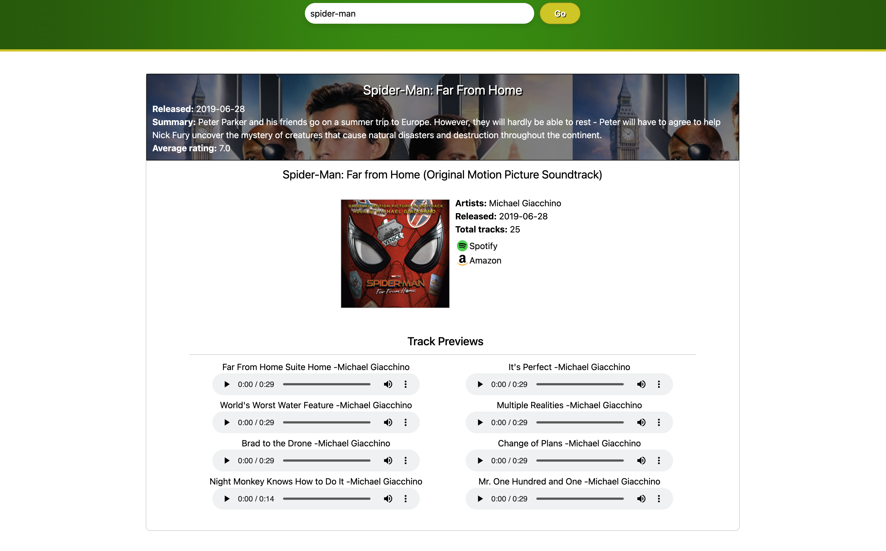

# CineMelodies App

## Introduction
The CineMelodies application is crafted to empower users with the ability to search for their favorite movie soundtracks and delve into comprehensive details about beloved movies.

## Screenshots

## Usage 
On the homepage, you have the option to explore a curated collection of pre-populated movies categorized by genres. By clicking on individual cards, you can access detailed information about the movie, including soundtrack previews. Additionally, you can search for your favorite movie. Upon pressing the "Go" button, you will be directed to another page displaying your search results. Clicking on the preferred card provides further details about the movie and previews of the soundtrack.

## Live Demo
[Website link>](https://cinemelodies.netlify.app/)

## Creators

  #### The Ternary Operators.
- [Chantal](https://github.com/chantalcassinijones)
- [Jonathon](https://github.com/jonathon10k)
- [Oluseyi](https://github.com/seyiturbo)
- [Calvin](https://github.com/calvin-manu)
- [Rich](https://github.com/Rich90U)

## Acknowledgements

[Figma](https://www.figma.com),
[Axios](https://axios-http.com/docs/intro),
[React](https://react.dev/),
[Slack](https://slack.com/intl/en-gb),
[TMBD](https://www.themoviedb.org/?language=en-GB),
[Tailwind](https://tailwindcss.com/),
[Spotify](https://developer.spotify.com/documentation/web-api),
[Nodejs](https://nodejs.org/en),

