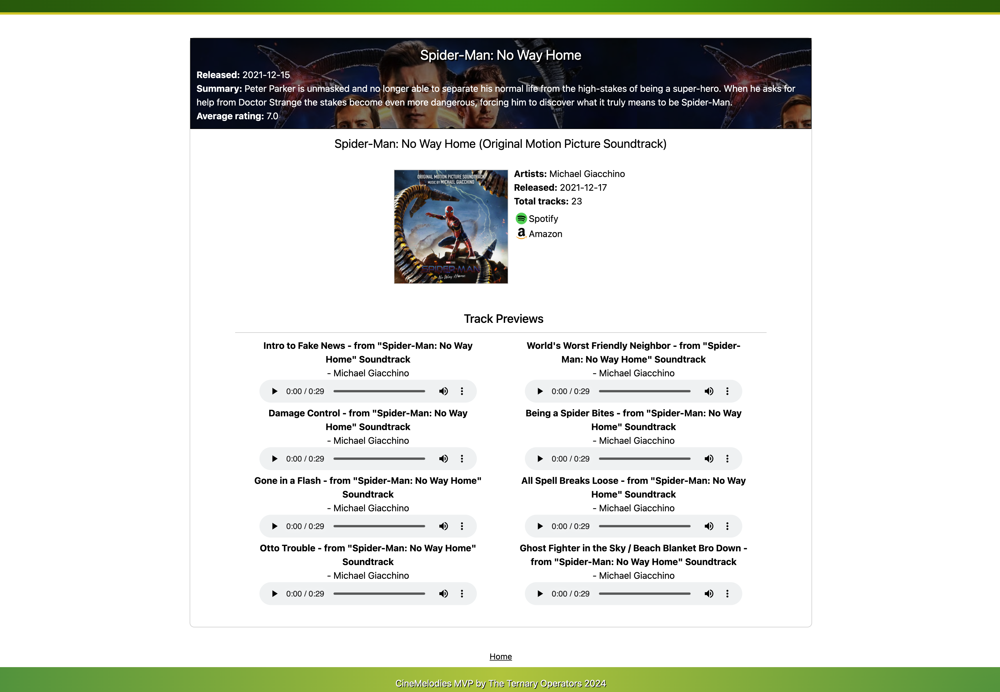

# CineMelodies App

## Introduction
The CineMelodies application is crafted to empower users with the ability to explore information on their favourite - and new favourite - movies, providing not only images and core movie information, but also comprehensive soundtrack information including playable audio previews. CineMelodies provides a comprehensive resource on not only the movies, but the sounds behind the movies.

## Screenshots
#### Home screen

#### Search screen

#### Search item result screen

## Utilization
On the homepage, you have the option to explore a curated collection of pre-populated movies categorized by genres. By clicking on individual cards, you can access detailed audio/video information about the movie, including soundtrack previews. Additionally, you can search for your favorite movie - upon pressing the "Go" button, you will be directed to another page displaying your search results. Clicking on the preferred card provides further details about the movie and previews of the soundtrack.

## Live demo
[Website link](https://cinemelodies.netlify.app/)

## Video demo
[Video demo (note: slightly outdated)](https://jonathon10k.github.io/module12-generated-profile/cinemelodies-demo.mp4)

## Creators

  #### The Ternary Operators.
- [Chantal](https://github.com/chantalcassinijones)
- [Jonathon](https://github.com/jonathon10k)
- [Oluseyi](https://github.com/seyiturbo)
- [Calvin](https://github.com/calvin-manu)
- [Rich](https://github.com/Rich90U)

## Technologies
#### New = New technology
[Figma](https://www.figma.com),
[Axios](https://axios-http.com/docs/intro),
[React](https://react.dev/),
[Slack](https://slack.com/intl/en-gb),
[TMDb](https://www.themoviedb.org/?language=en-GB),
[Tailwind[New]](https://tailwindcss.com/),
[Spotify](https://developer.spotify.com/documentation/web-api),
[Nodejs](https://nodejs.org/en),
[Hooks (including useNavigate & useLocation[New])](https://legacy.reactjs.org/docs/hooks-overview.html),
[React-Player package[New]](https://www.npmjs.com/package/react-player)

